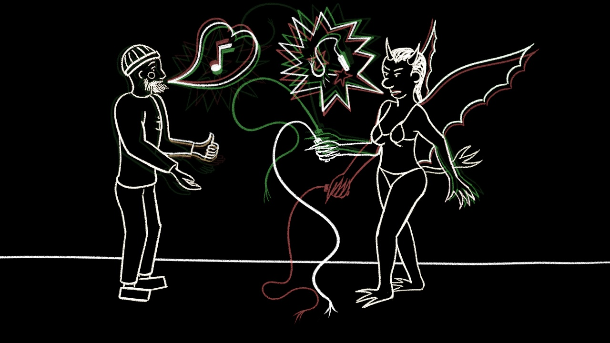

Turbo Argument
===============

The grandson of Captain Haddock and the niece of the Grumphy Smurf made the mistake to go as a couple. Explore the possibles ends of this conflict!

An experimental digital comic, both in technology and narration, where you are throw back in time !

### Music  
"Stoneworld Battle" and "Carpe Diem" by Kevin MacLeod ([incompetech.com](http://incompetech.com/))
[Licensed under Creative Commons: By Attribution 3.0 License](http://creativecommons.org/licenses/by/3.0/,creativecommons.org/licenses/by/3.0/)

### Font  
"chawp" by [AWP](http:/www.awpny.com), SIL Open Font License   

### Made with
[Krita](http://krita.org/) 3.3.2 and the [Godot](https://godotengine.org/) Game Engine 3.0 alpha 2
for [Angoulême Comic Festival Digital Challenge 2018](http://www.bdangouleme.com/1184,edition-2018-du-concours-challenge-digital)

### Thanks
to my tippers on [www.tipeee.com/nylnook](https://www.tipeee.com/nylnook), to the Godot contributors
and particularly to Leon Krause (a.k.a Eska014) for his work on HTML5/WebAssembly export

## License
Licenced under a [Creative Commons Attribution-ShareAlike 4.0 International (CC BY-SA 4.0)](https://creativecommons.org/licenses/by-sa/4.0/deed.en)

